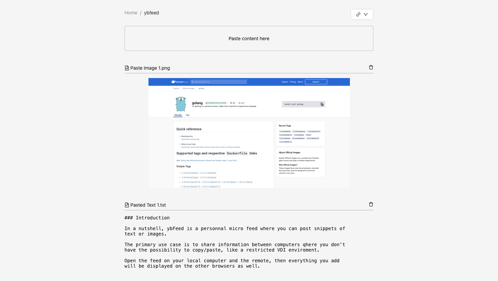

### Introduction

In a nutshell, ybFeed is a personnal micro feed where you can post snippets of 
text or images.

The primary use case is to share information between computers where you don't
have the possibility to copy/paste, like a restricted VDI environment.

Open the feed on your local computer and the remote one, then everything you add
will be displayed on the other browser as well.

### Concepts

When going to the home page, you are invited to create a feed with a unique
name.

Once on a feed, you can paste data on it, text or images, they will be added
to the feed by reverse order.

You can then decide to share the feed two different ways :

- Copy a secret link to the feed, than you can paste on a different computer,
you will be automatically authenticated
- If copy/paste is not an option, you can set a temporary 4 digit PIN. You then
go to the other computer and it will ask for the PIN when you open the page.

That's pretty much all there is to it, you can paste and delete items from any
browser.

### Screenshot



### Caveats

This is just a side project I'm working on, so there is probably lots of issues

Here are some I already identified :

- Paste might not work over non secured connections (https)
- ybFeed relies on a cookie to authenticate the session, if the cookie is lost
there is no easy way to retrieve the feed (you can get it from the `secret` file
in the feed directory)
- Most modern browser won't honor loog cookie lifetime, some alternative
authentication would be needed to get access once the cookie is expired
- Security could probably be improved, tokens and PINs are stored in clear on
the filesystem
- No rate control or capacity limits, quite exposed to flooding as it is

### Environment variables
| Variable name | Description |
|---------------|-------------|
| `YBF_DATA_DIR` | points to an alternative direcotry to store data, default is `./data/` in current directory. |
| `YBF_HTTP_PORT` | TCP port to run the server, default is `8080`. |

### Installation

#### Using Docker registry

Use this method to treat youself with a quick demo of the most current version

```
docker run -p 8080:8080 -v $(pwd)/data:/data ghcr.io/ybizeul/ybfeed:latest
```

You can now point your browser to http://localhost:8080/

#### Using Docker from source

Use this methond if you're interested by the code and hacking around

```
git clone https://github.com/ybizeul/ybFeed.git
cd ybFeed
docker compose up -d
```

You can now point your browser to http://localhost:8080/

### Building

#### Using Makefile

```
make
```

#### Manually

Once you cloned the repository, issue the following commands :
```
# Install node dependencies
cd ui
npm install

# Build UI
npm run build

# Build Go binary
cd ../
go build -o ybFeed *.go

# Run ybFeed
./ybFeed

# Point your browser to port 8080
```

#### Building container

```
docker build . -t ybfeed
```

